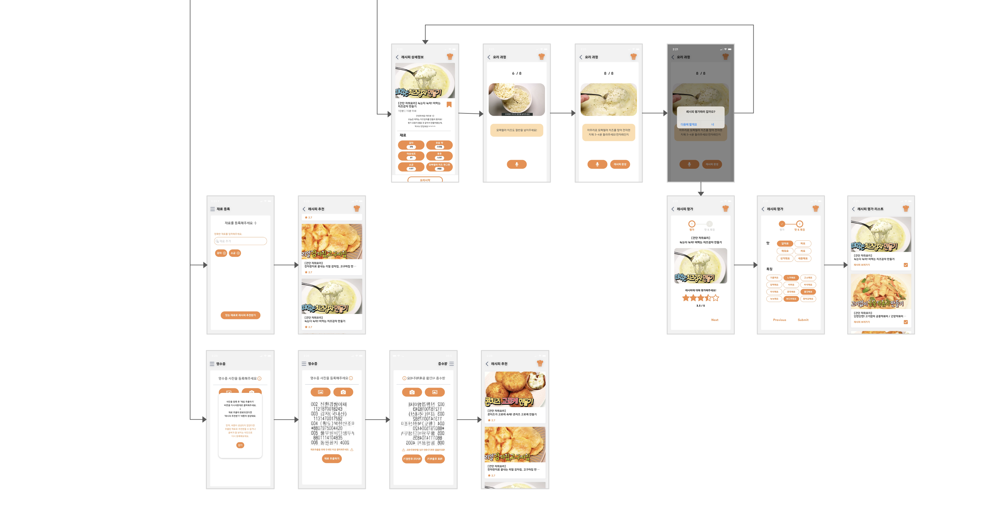

# CookSistant-project
> _자취생을 위한 평가기반 레시피 추천 서비스_

## 프로젝트 개요
### 프로젝트 소개 [CookSistant(쿡시스턴트)]
- **개발 기간** : 2021.03.01 ~ 2021.04.09
- **인원** : Backend(2), Frontend(3)
- **한 줄 소개** : 자취생을 위하여 사용자가 레시피에 대하여 최근 평가한 내용과 본인과 비슷한 평가를 한 사용자들의 평가를 기반으로 레시피를 추천해주는 서비스

## 기술스택 
     
      
   

## 아키텍처

## 화면흐름도

## 주요기능
